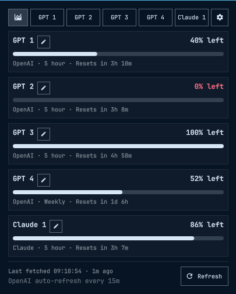

# AI Usage

See the AI usage left across your local profiles from the Omarchy bar.

<p align="center">
  
</p>

Version 1.1 supports OpenAI Codex and Claude Code profiles. AI Usage checks
each profile through its installed official CLI and keeps the latest display
data in a local cache. The popup opens from that cache, so it does not wait for
a network request. Kimi and Grok are not supported yet.

## Install

AI Usage is built for Omarchy Quattro and its shell plugin system. It also
needs Python 3 and at least one supported, signed-in CLI profile. Install the
Codex CLI for OpenAI profiles and Claude Code for Claude profiles. The folder
picker uses GTK 4 and PyGObject.

Once the plugin is listed, its page on
[Omarchy Plugins](https://plugins.omarchy.org/) will provide the install
command. To install it directly from this repository, run:

```bash
omarchy plugin add https://github.com/Cees-Kettenis/omarchy-ai-usage.git --enable
```

Omarchy shows the source URL, asks for confirmation, validates the manifest,
and lets you choose the bar position. This plugin has no separate installer
and does not request elevated privileges.

## Update or remove

Update an installation managed through Git:

```bash
omarchy plugin update ai-usage
```

Before uninstalling, open settings and click **Remove Claude Code usage capture**
if you enabled capture. Wait for the result, then remove the plugin:

```bash
omarchy plugin remove ai-usage
```

Omarchy's remove command does not clean up Claude settings. Without the capture
removal step, Claude Code keeps a command pointing at the removed plugin.
If you enabled capture at an older profile location, select and save that
location to remove capture there too. See the [user guide](docs/user-guide.md).

## What you get

- One summary for every OpenAI and Claude profile, with the five-hour limit
  preferred over the weekly limit.
- A detail view for each profile with all available limits and reset times.
- OpenAI API refresh on hover/open, on a schedule, or both, plus a manual
  refresh button.
- A configurable cooldown that prevents repeated OpenAI hover refreshes.
- Privacy mode that skips account identity requests and hides account details.
- A sleep schedule that pauses scheduled OpenAI checks without blocking manual
  ones.

## Claude setup

Claude defaults to **Single account** at `~/.claude`. To use more accounts,
choose **Multiple accounts** and select a parent folder whose immediate
children are separate `CLAUDE_CONFIG_DIR` homes. Save your profile locations,
then click **Enable Claude Code usage capture** in settings.
This adds a local status-line command to the saved Claude profiles. Make a
request in each Claude Code profile to populate its usage. Repeat setup after
adding a profile. Routine refreshes never change Claude settings.

Claude Code sends the documented five-hour and seven-day subscription windows
to the plugin's local status-line command. The command does not use API tokens,
and the collector uses the documented `claude auth status` command to check
which account is signed in. AI Usage does not read Claude credential contents
or call an undocumented Anthropic endpoint.

If a Claude profile already has a custom status line, setup leaves it
unchanged and reports that capture could not be installed for that profile.
Capture also displays a compact usage line
inside Claude Code. See [How it works](docs/how-it-works.md) for lifecycle
details, status-line tradeoffs, and multi-account examples.

Profile names default to their folder names. Use the pencil beside a profile
name to change that profile only. Saved names also appear in the profile
switcher and profile heading.

## Documentation

- [User guide](docs/user-guide.md) walks through setup, everyday use, and removal.
- [How it works](docs/how-it-works.md) covers profiles, caching, settings,
  controls, privacy, and command-line use.
- [Development and releases](docs/development.md) covers local checks, release
  tags, archives, and the marketplace checklist.

## License

[MIT](LICENSE) © 2026 Cees Kettenis
