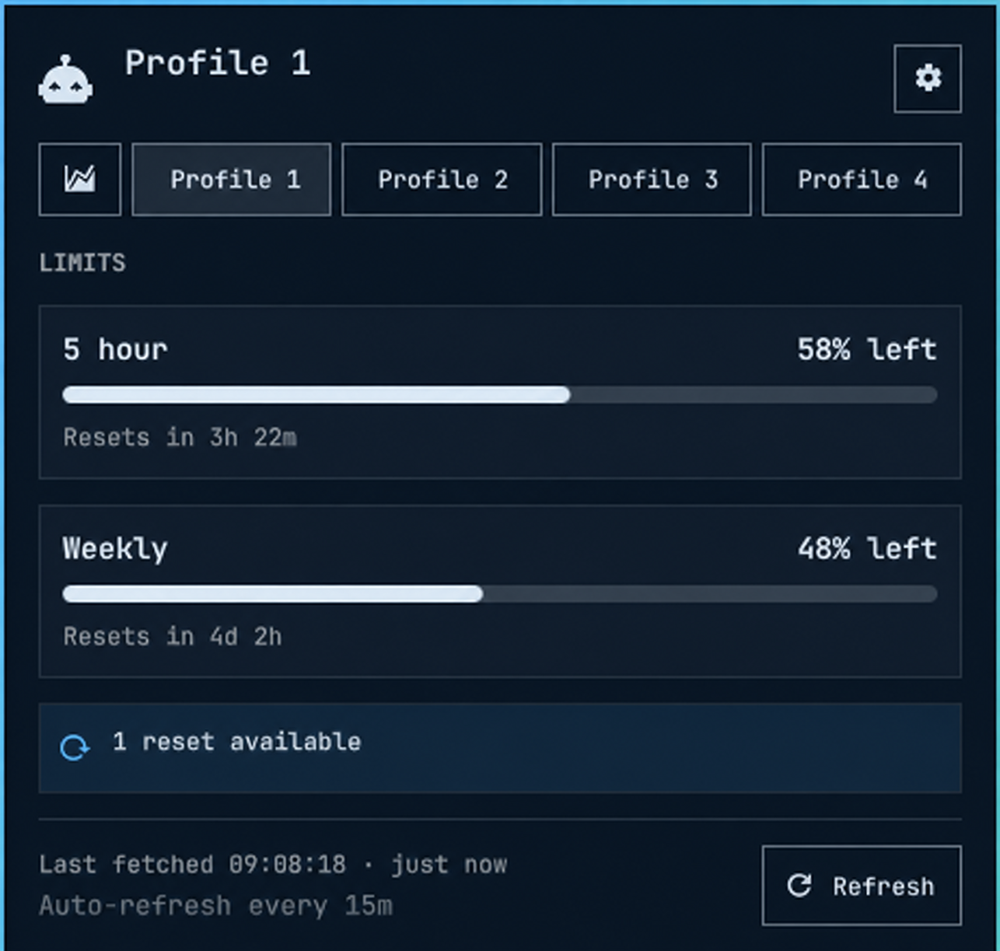
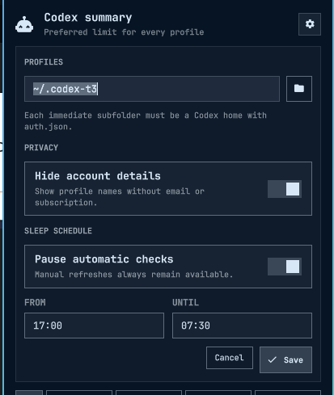

# How Codex Status works

<p align="center">
  
  
</p>

Codex Status has two parts. `collector.py` fetches usage data and writes a
small cache file. `Panel.qml` reads that file and renders the bar popup.

## Fetching usage

The collector scans one profiles folder. Each immediate subfolder is treated
as a separate `CODEX_HOME` and must contain an `auth.json` file.

```text
~/.codex-profiles/
├── profile-one/
│   └── auth.json
├── profile-two/
│   └── auth.json
└── profile-three/
    └── auth.json
```

For each profile, the collector starts the installed `codex app-server` with
that folder as `CODEX_HOME` and requests its rate limits. It does not parse or
copy `auth.json`.

The collector writes display data to:

```text
~/.cache/omarchy/codex-status/status.json
```

`$XDG_CACHE_HOME` replaces `~/.cache` when it is set. The cache directory uses
mode `0700`, and the status file uses mode `0600`.

## Summary and profile views

The summary shows one bar per profile. It uses the five-hour limit when one is
available and falls back to the weekly limit otherwise.

Selecting a profile shows all of its limits, reset times, credit balance, and
rate-limit resets. The popup also shows when the last successful fetch
finished.

## Settings

Open the popup and select the gear button.

<p align="center">
  
</p>

The settings panel controls:

- Profiles folder. Choose the parent folder that contains your Codex homes.
- Hide account details. This is on by default and keeps identity data out of
  the request and cache.
- Pause automatic checks. Set a local start and end time for the sleep window.

Sleep mode only pauses scheduled checks. The last cached result stays visible,
and manual refresh still works.

## Refresh behavior

The widget refreshes every 15 minutes by default. Opening the popup reads the
cache immediately. Fetching runs separately and updates the view when it
finishes.

Use the refresh button, right-click the bar icon, or press `r` or Enter to
fetch immediately.

## Controls

- Left-click the bar icon to open or close the popup.
- Right-click or middle-click the icon to refresh.
- Use `h` and `l`, or the arrow keys, to move between tabs.
- Press `r` or Enter to refresh.
- Press Escape to close the popup.

## Command line

Print the cached result without fetching:

```bash
~/.config/omarchy/plugins/codex-status/collector.py --cached --print
```

Fetch now using the configured profiles folder:

```bash
~/.config/omarchy/plugins/codex-status/collector.py --force --print
```

Use another profiles folder for one run:

```bash
~/.config/omarchy/plugins/codex-status/collector.py \
  --profiles-root /path/to/profiles \
  --force \
  --print
```

Identity stays hidden unless you pass `--show-identity` explicitly.
